# Gemma
Người viết: Nguyễn Văn Nguyễn   
Email: nguyenvannguyen192402@gmail.com   
# A. Các phần chi tiết của báo cáo này.  
1. Xây dựng dataset cho huấn luyện Gemma với chủ đề du lịch và địa lý.  
2. Nghiên cứu Research system role + system prompt. 
# B. Nội dung. 
I. Xây dựng dataset cho huấn luyện Gemma với chủ đề du lịch và địa lý. 
Gồm 
- Bước 1: thu thập dữ liệu thô từ wikipedia về chủ đề du lịch với địa lý (bước này sử dụng code python). 
- Bước 2: sử dụng chatgpt xử lý từ text thô ban đầu chuyển thành dạng dataset cho huấn luyện gemma. 
{"instruction": "câu hỏi", "context":"", "response": "câu trả lời", "category": "du_lich"} 
- câu hỏi: là câu hỏi mà mô hình chatgpt sinh ra sau khi xử lý nội dung text đầu vào. 
- câu trả lời: là câu trả lời mà mô hình trích xuất từ text ban đầu để trả lời câu hỏi. 
* Ví dụ cho cách tạo dữ liệu: 
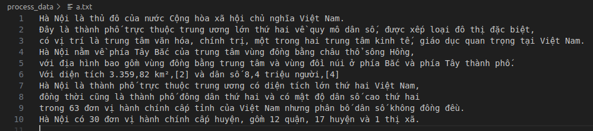
Hình ảnh trên là dữ liệu thô ban đầu thu thập được trên internet như wiki và các website du lịch.   
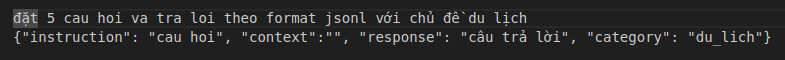  
Yêu cầu mà người dùng (user) truyền vào mô hình.   
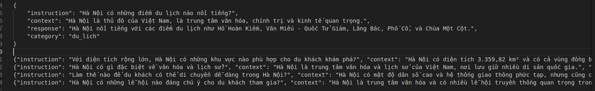 
Kết quả mô hình ChatGPT trả về.   
* file dữ liệu hiện tại 15 nghìn dòng file jsonl. 
Xem file chi tiết tại [link](https://drive.google.com/file/d/1Hy_1WjY7aIDTOuLcEO3iZ7Dh3xm6q7WZ/view)  
# II. Research system role + system prompt   
# System Prompt: lời nhắc hệ thống.  
+ Là những hướng dẫn do các nhà phát triển mô hình AI cung cấp cho các mô hình AI. 
+ Được thiết lập ngữ cảnh, giọng điệu, ranh giới cho các lời phản hồi.  
=> Lời nhắc hệ thống hoạt động như một khuôn khổ hướng dẫn, định hình hành vi và phong cách của AI trong suốt quá trình tương tác, để đảm bảo rằng mô hình phù hợp với mục tiêu cụ thể cung cấp trải nghiệm người dùng mong đợi, duy trì tính nhất quán trong phản hồi.
# 1. Ví dụ Prompt  
- Prompt cơ bản (Prompt đơn) mà người dùng thường nhập thông tin cho mô hình.  
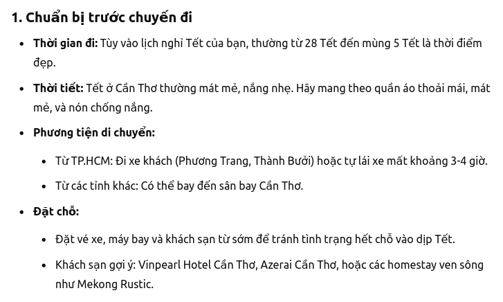

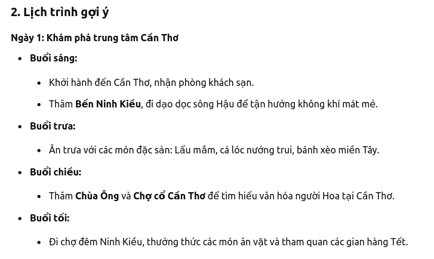

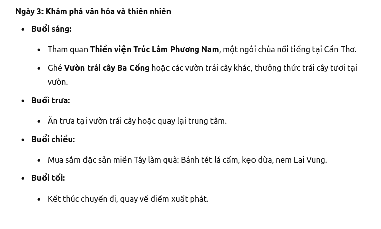

# 2. Ví dụ System Prompt.  
- System Prompt chứa ngữ cảnh, hướng dẫn và mô tả nhiệm vụ chi tiết cho mô hình.
 

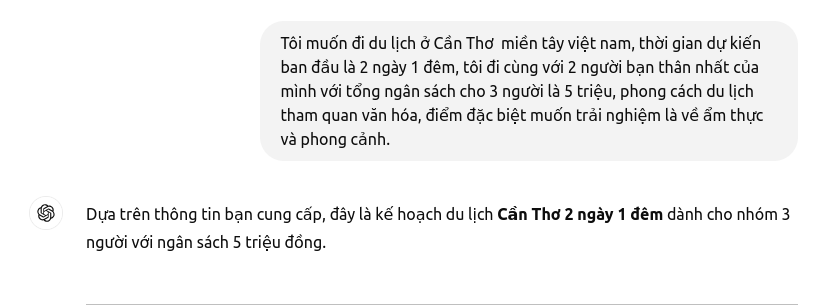

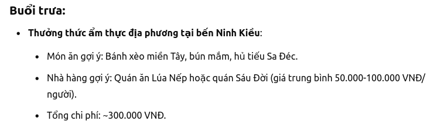

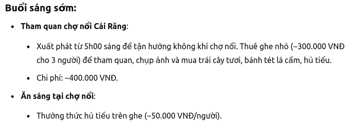

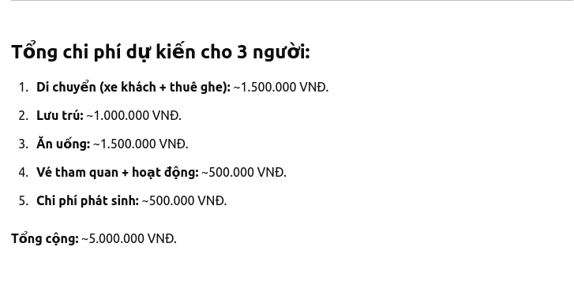

# 3. System Prompt kết hợp với ví dụ minh họa.
- System Prompt chứa ngữ cảnh, hướng dẫn và mô tả nhiệm vụ chi tiết cho mô hình với ví dụ minh họa đính kèm.
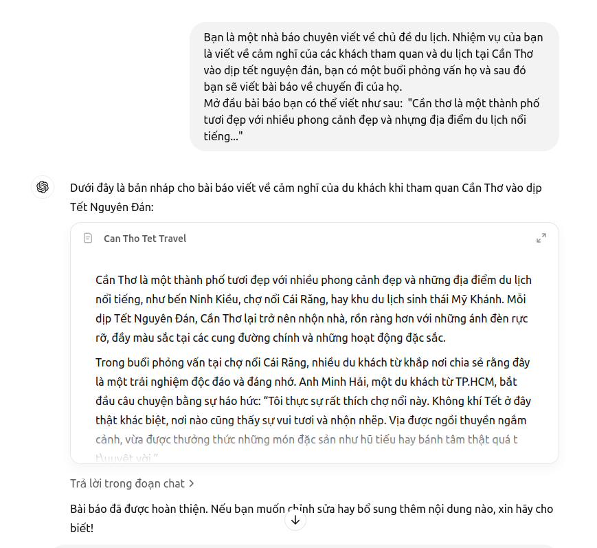
Kết Luận: Một System Prompt thường có các đặc điểm sau.
- Hướng dẫn nhiệm vụ và mục tiêu.
- Đặc điểm tính cách, vai trò và hướng dẫn giai điệu.
- Thông tin theo ngữ cảnh cho đầu vào của người dùng
- Những hạn chế về sáng tạo và hướng dẫn về phong cách.
- KIến thức, dữ liệu hoặc tài liệu tham khảo bên ngoài.
- Các quy tắc, hướng dẫn và rào cản cần thiết.
- Tiêu chuẩn và yêu cầu xác minh đầu ra.
# System Role.
#  1. Ví dụ System Role.
- Xác định và quản lý các vai trò khác nhau trong cuộc trò chuyện.
- Ví dụ minh họa với ChatGPT.
# 2. Vai trò người dùng Role user
- Đại diện cho con người tương tác với mô hình AI.
- 

